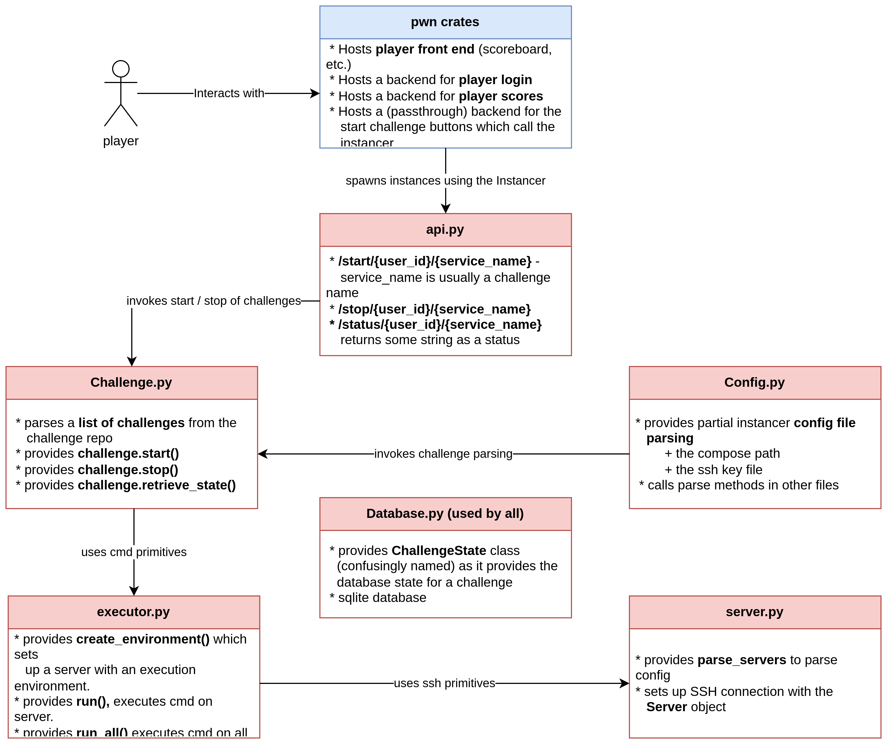

# Instancer
"Kinda like a poor man's instancer" - Delta 

A minimalistic(ish) challenge instancer built on top of FastAPI, Docker and SSH.

## Design
Please remember that the studsec techstack for challenges looks something like this:


The instancer is responsible for starting and stopping challenge containers found in a
challenge repo on some (ssh-connected) servers. The instancer acts very much like
a control plane, starting and stopping VMs and setting up their ports. 

The Instancer interacts with [**pwncrates**](https://github.com/StudSec/pwncrates)
through a webAPI defined in ./webapp/api.py. Additionally, this repo interacts with
a **challenge repo** in the form of: 
[**Challenges**](https://github.com/StudSec/Challenge-examples) using an API to be
properly defined.

## Installation
Firstly build the Docker container, this will only need to be done once.
```commandline
docker-compose build
```

Next, place the required files/folders at the following locations:
```
challenges/ -> Challenge repository, crucially including a docker-compose.yml
keys/ -> SSH private key
```

Finally, you need to configure the instancer, the default settings are recommended. However, you will need to add the
challenge servers
```toml
[servers.node1]
ip = "10.191.0.205"
port = "22"
user = "root"
path = "/srv"
```
Here the `ip` value is mandatory, other fields can be specified on a per-server basis, if absent the value from 
`[servers.default]` will be used.

Upon startup, the `path` directory will be cleared and populated with the challenge data.

## Tests
a simple test has been added in ./test/test.py. In here every function prefixed
with test will be treated as such. The tests can be executed with the following
command when the container is running:

```bash
docker exec -it instancer  /usr/local/bin/pytest ./test.py
```

## API
From your challenge provider you'll want to interface with the instancer. For this the following API is provided:
#### Start
```
/start/{user_id}/{service_name}
```
Takes an arbitrary `user_id` and a defined `service_name` and starts the challenge. The `service_name` is defined
in the challenge `docker-compose.yml`.

#### Stop
```
/stop/{user_id}/{service_name}
```
Takes an arbitrary `user_id` and a defined `service_name` and stops the challenge. The `service_name` is defined
in the challenge `docker-compose.yml`.

#### Status
```
/status/{user_id}/{service_name}
```
Takes an arbitrary `user_id` and a defined `service_name` and returns the challenges status. The `service_name` is defined
in the challenge `docker-compose.yml`.
 
